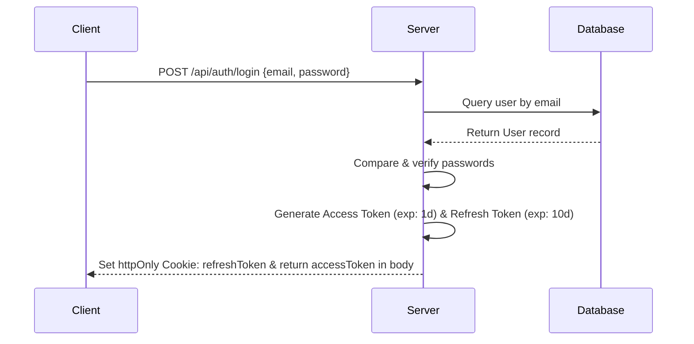
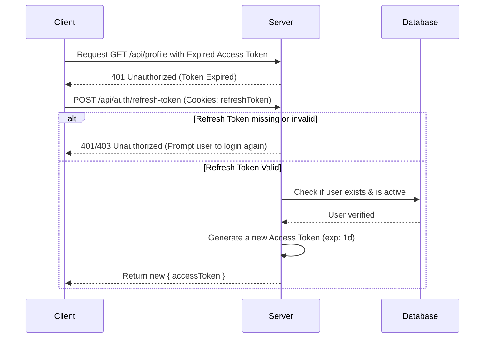

# Access Token & Refresh Token Flow in Express.js

This document explains the concepts, flow, and specific implementation details of how **Access Tokens** and **Refresh Tokens** work in your application.

---

## 1. What are Access and Refresh Tokens?

In modern web development, we use **JSON Web Tokens (JWT)** for authentication because they are stateless (the server doesn't need to store session data in a database/memory for every active user).

- **Access Token**:
  - **What**: A short-lived token (e.g., `1d` in your code) used to authorize requests to protected APIs.
  - **When**: Sent with every single request to protected resources (in the `Authorization` header).
  - **Why**: Since it is short-lived, if an attacker steals it, they can only access the account for a limited time.
- **Refresh Token**:
  - **What**: A longer-lived token (e.g., `10d` in your code) used solely to request a _new_ Access Token.
  - **When**: Stored securely in a cookie and sent only to the `/refresh-token` endpoint when the Access Token expires.
  - **Why**: It allows the user to stay logged in seamlessly without typing their password every time their Access Token expires. Since it's stored in a `httpOnly` cookie, it is protected against Cross-Site Scripting (XSS) attacks.

---

## 2. The Complete Authentication Flow

Here is how the client and server interact step-by-step:

### A. Login Flow



### B. Accessing Protected Route

```mermaid
sequenceDiagram
    participant Client
    participant Middleware
    participant Database
    participant Controller

    Client->>+Middleware: GET /api/profile (Authorization: accessToken)
    alt Token Missing or Invalid
        Middleware-->>-Client: 401 Unauthorized
    else Token Valid
        Middleware->>+Database: Verify user & active
        Database-->>-Middleware: User verified
        Middleware->>+Controller: req.user = decoded; next()
        Controller-->>-Client: Profile data
    end
```

### C. Token Refresh Flow (When Access Token Expires)



---

## 3. Code Breakdown: What happens, When, and Why

Let us walk through the exact code in your workspace.

### Step 1: User Login & Initial Token Generation

- **File**: [auth.service.ts](file:///E:/code%20and%20relavent%20documets/ph%20zankar%20mahbub/level-2-nextl-level-web-7/mission-2/express-learning/src/modules/auth/auth.service.ts#L6-L52)
- **What**:
  1. It verifies the user's password using `bcrypt.compare`.
  2. It signs **two separate tokens** using two different secret keys (`config.secret` and `config.refresh_secret`).

  ```typescript
  const accessToken = jwt.sign(jwtpayload, config.secret as string, {
    expiresIn: "1d",
  });

  const refreshToken = jwt.sign(jwtpayload, config.refresh_secret as string, {
    expiresIn: "10d",
  });
  ```

- **When**: Runs when the user submits their email and password on the Login page (`POST /api/auth/login`).
- **Why**:
  - The `accessToken` is returned directly to the client (to be stored in frontend memory/localStorage).
  - The `refreshToken` is placed in a secure **HTTP-only Cookie** via [auth.controller.ts](file:///E:/code%20and%20relavent%20documets/ph%20zankar%20mahbub/level-2-nextl-level-web-7/mission-2/express-learning/src/modules/auth/auth.controller.ts#L8-L13):
  ```typescript
  res.cookie("refreshToken", refreshToken, {
    secure: false, // Set to true in production (HTTPS only)
    httpOnly: true, // Prevents Javascript from accessing this cookie (XSS protection)
    sameSite: "lax",
  });
  ```

---

### Step 2: Authorizing Protected Routes

- **File**: [auth.ts](file:///E:/code%20and%20relavent%20documets/ph%20zankar%20mahbub/level-2-nextl-level-web-7/mission-2/express-learning/src/middleware/auth.ts#L8-L72)
- **What**:
  1. Reads the token from the `Authorization` header (`req.headers.authorization`).
  2. Decodes and verifies it using `jwt.verify` and the **Access Token secret** (`config.secret`).
  3. Fetches the user from the database to check if they still exist, are active, and have the correct role.
- **When**: Automatically runs before any protected API route handler (e.g., viewing a profile or changing settings).
- **Why**: To ensure only logged-in users with a valid, non-expired `accessToken` can access protected data.

---

### Step 3: Refreshing the Access Token

- **File**: [auth.service.ts](file:///E:/code%20and%20relavent%20documets/ph%20zankar%20mahbub/level-2-nextl-level-web-7/mission-2/express-learning/src/modules/auth/auth.service.ts#L54-L102) and [auth.controller.ts](file:///E:/code%20and%20relavent%20documets/ph%20zankar%20mahbub/level-2-nextl-level-web-7/mission-2/express-learning/src/modules/auth/auth.controller.ts#L29-L47)
- **What**:
  1. Grabs the cookie token: `req.cookies.refreshToken`.
  2. Verifies it using the **Refresh Secret** (`config.refresh_secret`).
  3. Generates and returns a **brand new Access Token** (but does _not_ issue a new refresh token, keeping the old 10-day limit in place).
- **When**: Triggered automatically by the frontend whenever a request fails with a `401 Unauthorized` status code because the previous Access Token expired.
- **Why**: This is the core magic! It saves the user from having to log in again every 24 hours. The frontend requests a new `accessToken` in the background, updates it, and repeats the failed request seamlessly.

---

## 4. Key Security & UX Design Benefits

1.  **Defense against Token Theft**: If someone steals the `accessToken`, it becomes useless after `1d`. If they try to steal the `refreshToken`, they can't easily extract it because it's locked in the browser's `httpOnly` cookies.
2.  **Instant Access Revocation**: If a user is deactivated or deleted, both `auth` middleware and `/refresh-token` service query the database (`SELECT * FROM users WHERE email=$1`). Therefore, a deactivated user's requests will fail immediately, regardless of token expiration.
